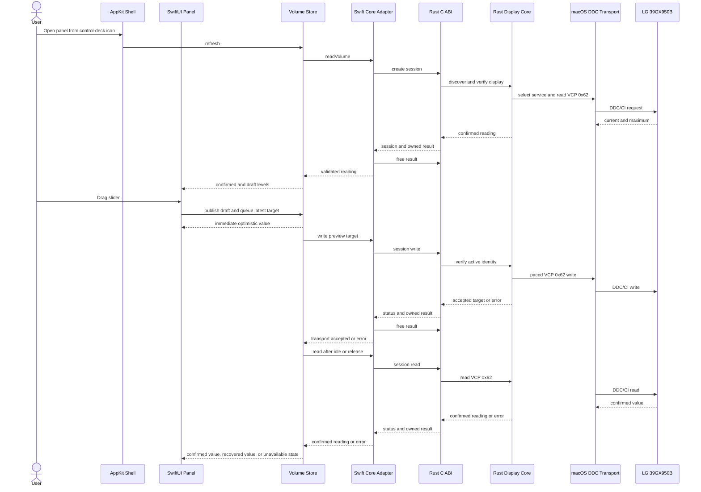
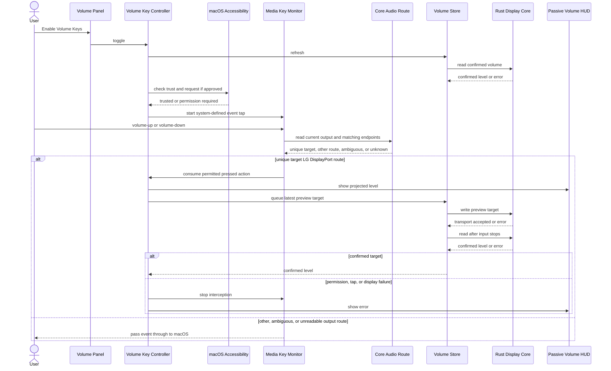

# DeskHelm Architecture And Runtime

## Workspace Model

DeskHelm is a workspace-first monorepo with two product entrypoints over one Rust core:

| Path | Ownership |
| --- | --- |
| `apps/deskhelm/src/lib.rs` | Public Rust volume API and library assembly |
| `apps/deskhelm/src/main.rs`, `cli.rs` | Command-line entrypoint and argument parsing |
| `apps/deskhelm/src/display.rs`, `display/macos.rs` | Display policy and Apple Silicon macOS DDC/CI transport |
| `apps/deskhelm/src/ffi.rs` | C ABI over the Rust volume API |
| `apps/deskhelm/macos/` | SwiftPM package for the native AppKit and SwiftUI app |
| `script/build_and_run.sh` | Rust/Swift build, app staging, launch, diagnostics, and Swift tests |
| `scripts/` | Repository-maintenance TypeScript and colocated tests |
| `packages/` | Reserved reusable packages; currently only `.gitkeep` |

The root is a virtual Cargo workspace. `apps/deskhelm/Cargo.toml` produces an `rlib` for the CLI and Rust consumers plus a `staticlib` for SwiftPM. macOS-only Cargo dependencies provide Core Foundation, Core Graphics, and IOKit access. The Swift package links `libdeskhelm` and the same three Apple frameworks; `DESKHELM_RUST_LIB_DIR` tells SwiftPM which Cargo output directory to search.

This layout results from the completed [Template Adoption](template-adoption.md). Its build and validation consequences are operated through [Operations](operations.md#native-app-build-and-run).

Sources: `Cargo.toml`, `apps/deskhelm/Cargo.toml`, `apps/deskhelm/macos/Package.swift`, `script/build_and_run.sh`.

## End-To-End Volume Flow

The CLI and menu-bar app share the Rust display core; neither invokes another display-control executable. The CLI uses one conservative discovery pipeline per command. The native app crosses a narrow C ABI and keeps one verified display session for its interactive lifetime.

The actor-owned session serializes hardware I/O away from the main actor. The store allows one preview in flight and retains only the newest pending target. A preview never updates `confirmedLevel`, and an older result never replaces a newer draft. A trailing or release-time read is authoritative. A mismatch triggers one exact set and readback. A failed preview or confirmation triggers one fresh recovery read. A failed refresh or recovery read clears confirmed state.

## Rust Core And CLI

`apps/deskhelm/src/lib.rs` exports `VolumeReading`, `read_volume`, and `set_volume`. `set_volume` rejects values above 100 before platform access. The package binary installs `color-eyre`, parses the required `volume` subcommand, and delegates to this library:

- `deskhelm volume` reads the current value.
- `deskhelm volume <LEVEL>` accepts `0..=100`, performs a verified write, and prints `<display>: <current>/<maximum>`.

The library exposes explicit unsupported-platform errors outside Apple Silicon macOS, so other targets can compile even though they cannot control hardware. Rust tests cover CLI parsing, display count and identity rules, supported range checks, write readback, packet parsing, checksums, ABI ownership, error conversion, and panic containment. Hardware effects remain outside unit tests.

Sources: `apps/deskhelm/src/lib.rs`, `apps/deskhelm/src/main.rs`, `apps/deskhelm/src/cli.rs`, `apps/deskhelm/src/display.rs`, `apps/deskhelm/src/display/macos.rs`, `apps/deskhelm/src/ffi.rs`.

## C ABI Boundary

`apps/deskhelm/src/ffi.rs` exports stateless operations plus an opaque session API mirrored by `apps/deskhelm/macos/Sources/CDeskHelm/include/deskhelm.h`:

| Symbol | Contract |
| --- | --- |
| `deskhelm_read_volume` | Populates a `DeskHelmVolumeResult` with a confirmed reading |
| `deskhelm_set_volume` | Validates an `int32_t` level, writes it, and returns the confirmed reading |
| `deskhelm_session_create` | Fully discovers and verifies one display, confirms a 0–100 volume range, and returns an opaque session plus the initial reading |
| `deskhelm_session_read` | Revalidates the active display identity and reads through the retained service |
| `deskhelm_session_write` | Revalidates identity, writes through the retained service, and returns the accepted requested value without readback |
| `deskhelm_session_set` | Revalidates identity, writes through the retained service, and returns an exact readback |
| `deskhelm_session_free` | Releases the retained display service |
| `deskhelm_volume_result_free` | Frees Rust-owned display/error strings and resets the result |

A result contains a current or accepted value, `maximum`, a nullable display C string, and a nullable error C string. Only read, set, and session-creation operations return confirmed values. Status codes distinguish success (`0`), runtime error (`1`), invalid argument (`2`), and contained Rust panic (`3`). Exported operations initialize non-null output storage before work, flatten Rust error chains into an owned error string, and use `catch_unwind` so a panic does not unwind through Swift/C. Callers must free each initialized result at most once unless an operation populates it again.

`DeskHelmCore` is a Swift actor. It serializes the synchronous ABI calls, retains the opaque session in a lifetime-owning handle, and discards that handle after any operation error. Each result is freed with `defer`. The adapter maps status codes into typed Swift errors and independently rejects a missing display label, a maximum other than 100, or a current value outside the returned range.

Sources: `apps/deskhelm/src/ffi.rs`, `apps/deskhelm/macos/Sources/CDeskHelm/include/deskhelm.h`, `apps/deskhelm/macos/Sources/DeskHelmAppCore/Services/DeskHelmCore.swift`.

## Native AppKit Shell

`DeskHelmMacMain` runs `NSApplication` with `.accessory` activation policy. The staged bundle also sets `LSUIElement=true`, so the app is menu-bar-only and has no Dock icon. `AppDelegate` constructs one `StatusItemController` around a `VolumeStore` backed by `DeskHelmCore`.

`StatusItemController` owns a square `NSStatusItem` and a transient `NSPanel`. The image-only status-bar button has no text title. `DeskHelmStatusIcon` configures the system `slider.vertical.3` symbol as a 15-point medium-weight template image so it reads as a compact control deck instead of a volume, display, or steering-wheel symbol. The tooltip and accessibility label identify DeskHelm's display controls.

The panel is transparent, borderless, nonactivating, floating at pop-up-menu level, and allowed across spaces/full-screen contexts. Opening it measures the hosted `VolumePanel`, positions it below or above the status button within the screen's visible frame, orders it forward without calling `NSApp.activate`, makes the panel key so its controls work, and starts a hardware refresh. `PanelHostingController` reports preferred-content-size changes so error text or other SwiftUI layout changes resize and re-anchor the visible panel; there is no fixed AppKit panel size.

Dismissal stays inside native window lifecycle APIs: after the panel has become key, it orders out when it later resigns key status and maps Escape through `cancelOperation`. It does not hide merely because the accessory app deactivates. The controller intentionally installs no global mouse or keyboard event monitor for panel dismissal. This keeps click-away behavior scoped to AppKit key-window transitions rather than observing system-wide input. The separate opt-in volume-key feature is documented below. Termination orders out the panel and removes the status item.

App startup writes `StatusItemReadyPID` and a diagnostic summary to `UserDefaults` under bundle identifier `com.acgbox.deskhelm`. This lets `--verify` confirm app-owned status-item construction, not whether a notch, limited menu-bar space, or third-party menu manager makes the item visible to the user. When launched for `--verify-panel`, the app also opens the panel and publishes its phase, visibility, key-window state, nonactivating style, screen intersection, window number, position, and size; the script accepts a shown or refreshed panel only when its required window state and positive dimensions are present. [Operations](operations.md#script-modes-and-diagnostics) owns both diagnostic commands and their limits.

Sources: `apps/deskhelm/macos/Sources/DeskHelmMac/App/DeskHelmMacMain.swift`, `apps/deskhelm/macos/Sources/DeskHelmMac/App/DeskHelmStatusIcon.swift`, `apps/deskhelm/macos/Sources/DeskHelmMac/App/StatusItemController.swift`, `script/build_and_run.sh`.

## SwiftUI Volume Panel

`VolumePanel` supplies a 360-point-wide content stack plus outer padding; its intrinsic height can grow when error status appears, and the AppKit shell follows that preferred size. The shell contributes no popover chrome, shadow, or second background. On macOS 26 or later the entire content uses one public `.clear.interactive()` Liquid Glass effect shaped as a continuous rounded rectangle; macOS 14 through 25 render the same single-surface structure with `.regularMaterial`. The header identifies the supported hardware surface as `LG 39GX950B` over `USB-C - DDC/CI`, while help text exposes the display label returned by the core.

`VolumeStore` separates `draftLevel` from `confirmedLevel`:

1. The slider remains disabled until a successful refresh establishes a confirmed reading.
2. Slider movement updates the local `Double` draft immediately and clamps it without rounding.
3. A 24 ms initial coalescing window starts one background preview write. At most one preview is in flight, and further movement replaces one pending target.
4. The store schedules a readback 150 ms after the latest input. Releasing the slider cancels that delay and confirms immediately.
5. Preview results do not update `confirmedLevel`. A matching readback publishes confirmation; a mismatch triggers an exact set and readback.
6. A failed preview or confirmation starts one fresh read. The actual reading replaces draft and confirmed state. A failed refresh or recovery read disables adjustment and leaves the error visible.

The panel also exposes refresh, volume-key enablement, and quit controls, busy state, and accessibility identifiers. It shows a progress indicator only while the first display read is unresolved. Preview writes and trailing confirmation keep the current controls stable instead of inserting and removing a spinner for every adjustment. It is DeskHelm's own control surface; it does not modify the disabled macOS Control Center slider or register a Core Audio output device. Those integrations would require a separate Core Audio HAL plug-in.

Swift tests inject a `VolumeControlling` actor stub. They cover smooth draft retention and range clamping, unresolved-initial-read loading feedback, unsupported maximum validation, successful and failed refresh, latest-target preview coalescing, automatic and release-time confirmation, return-to-confirmed behavior, refresh and stale-result races, recovery after preview or confirmation failure, and the pure level-animation policy. The suite does not currently exercise the AppKit status icon, dismissal boundary, screen positioning, dynamic panel resizing, or physical session reuse.

Sources: `apps/deskhelm/macos/Sources/DeskHelmAppCore/`, `apps/deskhelm/macos/Tests/DeskHelmAppCoreTests/VolumeStoreTests.swift`.

## Optional Keyboard Volume Control

Keyboard control is off by default and is enabled from the panel's ellipsis menu. `VolumeKeyController` checks existing Accessibility trust and shows its own disclosure before enablement when needed. It then refreshes the shared `VolumeStore`, requests macOS Accessibility permission if needed, and installs no event tap unless a confirmed display level and trust are available. The controller persists successful enablement only after the event tap starts. Restoring that preference at launch never raises the permission prompt: missing trust leaves the feature in `permissionRequired` state.

`MediaKeyMonitor` installs an active Core Graphics session event tap for `systemDefined` events only. The decoder accepts the undocumented auxiliary-control payload only for volume-up and volume-down press, repeat, and release states. For each decoded event, `DefaultAudioOutputRoute` queries Core Audio's current default output identity and enumerates matching audio endpoints. `VolumeKeyOutputRoutePolicy` permits interception only when the current device is the one unique DisplayPort endpoint whose normalized name is `LG ULTRAGEAR+` or contains `39GX950` and whose manufacturer is `GSM` or begins with `LG ELECTRONICS`. A non-target route, ambiguous match, or failed property lookup passes the event through to macOS; this event-time check also fails open during a held key if the user switches outputs. A permitted press or repeat is consumed and transferred to the main actor. Its release is consumed without another action. Unrelated system-defined events and recognized events for Mac speakers, headphones, or other displays pass through. `VolumeKeyController` owns state and DDC/CI work. DeskHelm does not subscribe to ordinary key-down/key-up events, retain input, inspect other apps, or intercept mute, but macOS Accessibility permission is broader than this allowlist.

The opt-in path confirms hardware before installing interception, gates each decoded event on the current Core Audio output route, applies each permitted key action to the current draft, coalesces preview writes, confirms once after input stops, and fails open either by passing a non-target event through or removing the filter when it cannot safely continue.

Each press or macOS system repeat changes the draft level by one point and clamps it to the display range. Holding a key therefore adjusts continuously without an app-owned repeat timer. The shared store sends the newest preview target and owns the trailing confirmation; `VolumeKeyController` does not wait for a full readback after each event. `VolumeHUDController` shows the projected value in a borderless, nonactivating, mouse-ignoring status-bar-level panel for 1.25 seconds; errors remain for two seconds.

`VolumeHUDController` retains one observable `VolumeHUDState` and one nonopaque SwiftUI hosting view instead of replacing its content view for every repeat. The HUD, open menu-panel slider, and numbers read the same projected level. The menu panel and HUD apply matching animation transactions derived from the same event timestamp. Repeated input uses a short linear duration equal to 60 percent of the preceding update interval, capped at 50 ms. It normally completes before the next event when cadence stays stable, instead of accumulating the fixed-duration lag. An isolated visible update uses 80 ms. First HUD presentation, sub-frame updates, level/error switches, and Reduce Motion updates are immediate.

On macOS 26 or later, one public AppKit `NSGlassEffectView` uses the clear style and owns the SwiftUI hosting view through its `contentView`. This keeps both the material and semantic content inside the same native glass surface. macOS 14 through 25 use one active `NSVisualEffectView` with the HUD-window material. The outer panel remains transparent, borderless, nonactivating, mouse-ignoring, and non-key, so it adds no opaque window background and does not borrow keyboard focus from the current application. Apple does not document cross-window Liquid Glass sampling for a standalone overlay panel, so this public surface can still render differently from a system-owned OSD. A new level also resets the dismissal timer without another layout pass, forced display, or synchronous preferences flush.

If the event tap is disabled, confirmed state is lost, or display communication fails, the controller removes the tap, clears the persisted request, marks the feature failed, and shows the error HUD. Later media-key events then return to macOS. Decoder tests cover accepted press/system-repeat/release payloads, rejection of mute or unrelated events, and one-point clamping. Route-policy tests cover the two accepted LG names, accepted manufacturer identities, normalization, non-display transport, other LG displays, unrelated manufacturers, unknown output state, unique-current-endpoint selection, non-target press/release pass-through, and target press/release disposition. They do not validate Core Audio property lookup, live output switching, the undocumented payload against physical keyboards, Accessibility prompting, event-tap suppression, or HUD presentation end to end.

This feature reuses the display safety boundary below and is built through [Operations](operations.md#native-app-build-and-run).

Sources: `apps/deskhelm/macos/Sources/DeskHelmMac/App/DefaultAudioOutputRoute.swift`, `apps/deskhelm/macos/Sources/DeskHelmMac/App/MediaKeyMonitor.swift`, `apps/deskhelm/macos/Sources/DeskHelmMac/App/VolumeKeyController.swift`, `apps/deskhelm/macos/Sources/DeskHelmMac/App/VolumeHUDController.swift`, `apps/deskhelm/macos/Sources/DeskHelmAppCore/Models/VolumeLevelAnimation.swift`, `apps/deskhelm/macos/Sources/DeskHelmAppCore/Models/VolumeKeyOutputRoute.swift`, `apps/deskhelm/macos/Sources/DeskHelmAppCore/Models/VolumeMediaKey.swift`, `apps/deskhelm/macos/Sources/DeskHelmAppCore/Stores/VolumeKeyFeatureState.swift`, `apps/deskhelm/macos/Sources/DeskHelmAppCore/Views/VolumeHUD.swift`, `apps/deskhelm/macos/Tests/DeskHelmAppCoreTests/VolumeLevelAnimationTests.swift`, `apps/deskhelm/macos/Tests/DeskHelmAppCoreTests/VolumeHUDStateTests.swift`, `apps/deskhelm/macos/Tests/DeskHelmAppCoreTests/VolumeKeyOutputRouteTests.swift`, `apps/deskhelm/macos/Tests/DeskHelmAppCoreTests/VolumeMediaKeyTests.swift`.

## Display Selection And Safety

On Apple Silicon macOS, a stateless CLI operation or native session creation:

1. Uses Core Graphics to enumerate active, non-built-in displays and requires exactly one.
2. Requires LG vendor ID `0x1e6d`; product `0x7863` receives the `LG 39GX950B` model label.
3. Discovers `DCPAVServiceProxy` services through IOKit and opens their undocumented `IOAVService` interfaces.
4. Reads EDID and requires exactly one service whose vendor/product identity matches the Core Graphics display.
5. Reads or writes only DDC/CI VCP feature `0x62` for audio volume.

A verified native session retains the selected `IOAVService`, display identity, label, and the completion time of the latest SET group. Every hot read, preview, or exact set repeats the Core Graphics external-display count and vendor/product check. It does not repeat IOKit discovery or EDID parsing. Session creation confirms maximum 100 before any session write. A preview uses the existing double-write transport and returns without readback. After any retained-session SET group, the next GET or SET waits until at least 50 ms has elapsed. An exact set then waits 80 ms, reads back, revalidates maximum 100, and fails unless the current value matches. The Swift owner discards the session after any error so the next operation must perform full discovery again.

The stateless CLI keeps its original pre-write read, 0–100 maximum check, post-write wait, and exact readback. Vendor/product matching cannot distinguish every stale service or two identical displays, so ambiguity remains a hard failure rather than a guess.

Sources: `apps/deskhelm/src/display.rs`, `apps/deskhelm/src/display/macos.rs`.

## LG 39GX950B USB-C Boundary

The physical hardware check is an LG 39GX950B (`1e6d:7863`) connected directly by USB-C to an M4 Max Mac. The cable carries DisplayPort Alt Mode; macOS exposes that connection through its external DCP/DP service path. The service name describes the macOS transport topology and does **not** mean the physical connector is DisplayPort.

This is a tested compatibility point, not a claim that every LG display or USB-C path works. DDC/CI must be enabled, the display must expose volume as 0–100, and the cable/dock/adapter path must pass DDC/CI traffic. DeskHelm uses standard DDC address `0x37`; paths requiring another address, including some built-in HDMI bridges, are unsupported. The undocumented `IOAVService` interface and display response timing can change across macOS versions, firmware, and connection hardware.

## Change Guide

- Rust API or display policy: start in `apps/deskhelm/src/lib.rs` and `display.rs`; preserve strict selection and confirmed writes.
- C ABI: update `ffi.rs` and `deskhelm.h` together; preserve status mapping, panic containment, and explicit result ownership.
- Native lifecycle: start in `DeskHelmMacMain.swift` and `StatusItemController.swift`; verify accessory behavior and status-item readiness.
- Panel state: start in `VolumeStore.swift` and `VolumePanel.swift`; add Swift tests for preview, confirmation, recovery, unavailable state, busy state, and errors.
- Keyboard control: keep `MediaKeyMonitor.swift`, `VolumeKeyController.swift`, `VolumeMediaKey.swift`, and the HUD aligned; preserve opt-in permission disclosure, the volume-only allowlist, main-actor hardware work, and fail-open tap removal.
- Hardware transport: start in `display/macos.rs`; retain packet tests and verify changes on the supported physical setup.
- Build or validation: update `Package.swift`, `script/build_and_run.sh`, and `Makefile.toml` consistently, then follow [Operations](operations.md).
