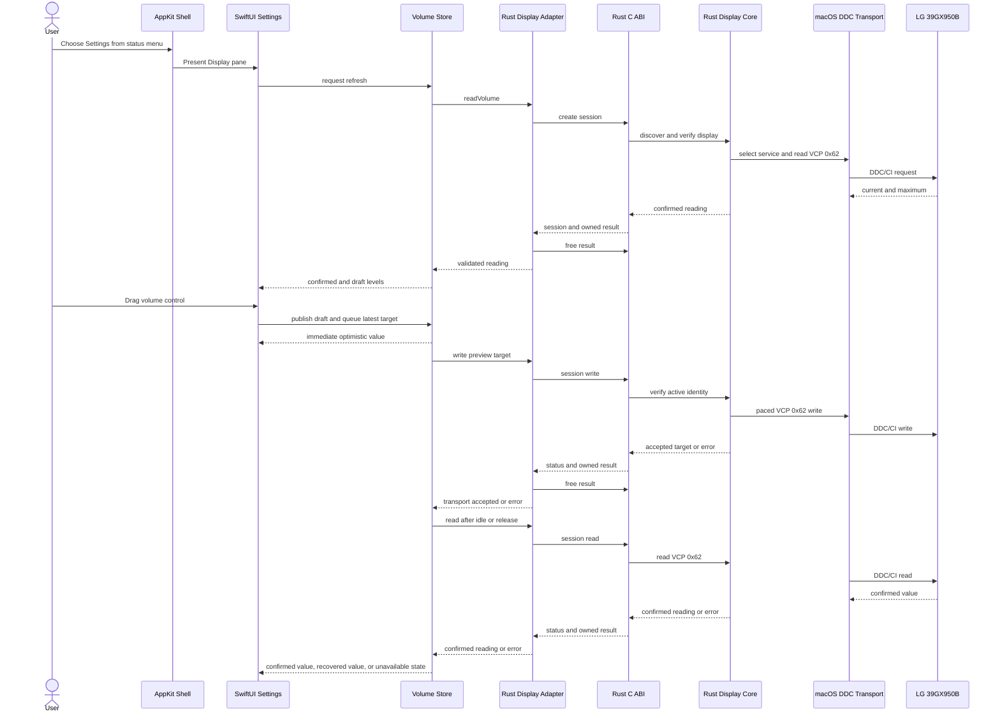
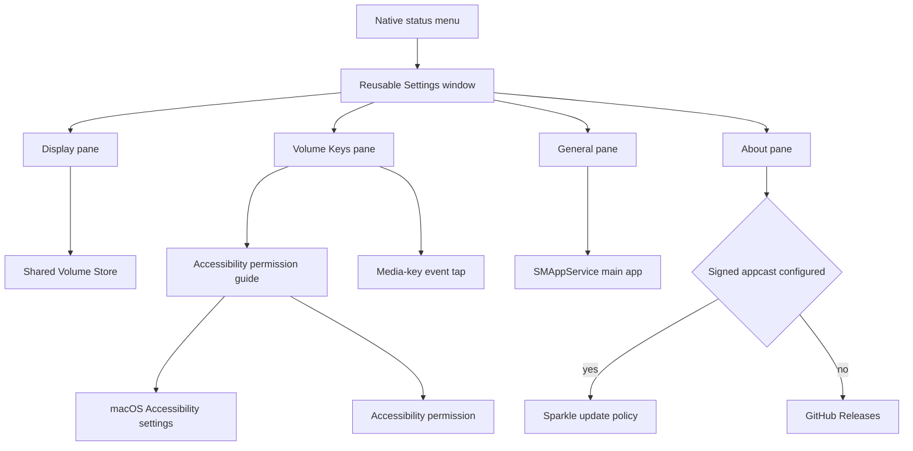
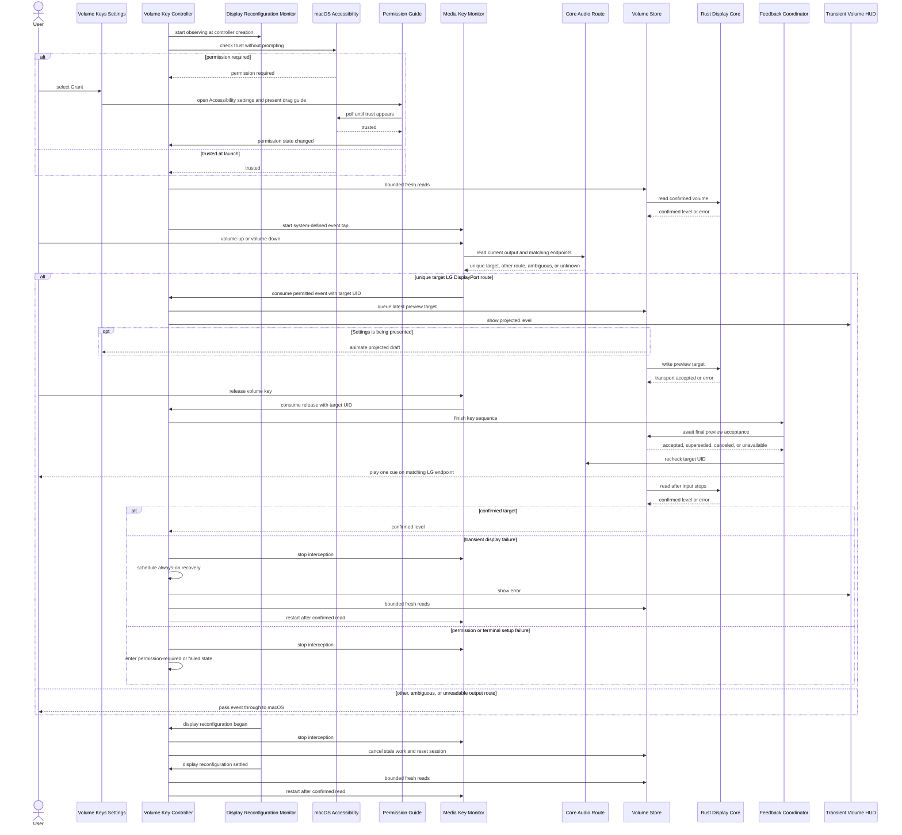

# DeskHelm Architecture And Runtime

## Workspace Model

DeskHelm is a workspace-first monorepo with two product entrypoints over one Rust display core. The Rust side owns display discovery, identity verification, verified sessions, DDC/CI transport, the CLI, and the C ABI. The Swift native application layer owns macOS lifecycle, interactive state, Core Audio route qualification, media-key handling, and AppKit/SwiftUI presentation:

| Path | Ownership |
| --- | --- |
| `apps/deskhelm/src/lib.rs` | Public Rust volume API and library assembly |
| `apps/deskhelm/src/main.rs`, `cli.rs` | Command-line entrypoint and argument parsing |
| `apps/deskhelm/src/display.rs`, `display/macos.rs` | Display policy and Apple Silicon macOS DDC/CI transport |
| `apps/deskhelm/src/ffi.rs` | C ABI over the Rust volume API |
| `apps/deskhelm/macos/` | SwiftPM package for the native AppKit and SwiftUI app |
| `script/build_and_run.sh` | Rust/Swift build, app staging, launch, diagnostics, and Swift tests |
| `scripts/` | Repository-maintenance TypeScript and colocated tests |
| `packages/` | Reserved reusable packages; currently only `.gitkeep` |

The root is a virtual Cargo workspace. `apps/deskhelm/Cargo.toml` produces an `rlib` for the CLI and Rust consumers plus a `staticlib` for SwiftPM. macOS-only Cargo dependencies provide Core Foundation, Core Graphics, and IOKit access. The Swift package links `libdeskhelm` and the same three Apple frameworks; `DESKHELM_RUST_LIB_DIR` tells SwiftPM which Cargo output directory to search.

This layout results from the completed [Template Adoption](template-adoption.md). Its build and validation consequences are operated through [Operations](operations.md#native-app-build-and-run).

Sources: `Cargo.toml`, `apps/deskhelm/Cargo.toml`, `apps/deskhelm/macos/Package.swift`, `script/build_and_run.sh`.

## End-To-End Volume Flow

The CLI and menu-bar app share the Rust display core; neither invokes another display-control executable. The CLI uses one conservative discovery pipeline per command. The native app crosses a narrow C ABI and keeps one verified display session for its interactive lifetime.

The actor-owned session serializes hardware I/O away from the main actor. The store allows one preview in flight and retains only the newest pending target. A preview never updates `confirmedLevel`, and an older result never replaces a newer draft. A trailing or release-time read is authoritative. A mismatch triggers one exact set and readback. A failed preview or confirmation triggers one fresh recovery read. A failed refresh or recovery read clears confirmed state.

## Rust Display Core And CLI

`apps/deskhelm/src/lib.rs` exports `VolumeReading`, `read_volume`, and `set_volume`. `set_volume` rejects values above 100 before platform access. The package binary installs `color-eyre`, parses the required `volume` subcommand, and delegates to this library:

- `deskhelm volume` reads the current value.
- `deskhelm volume <LEVEL>` accepts `0..=100`, performs a verified write, and prints `<display>: <current>/<maximum>`.

The library exposes explicit unsupported-platform errors outside Apple Silicon macOS, so other targets can compile even though they cannot control hardware. Rust tests cover CLI parsing, display count and identity rules, supported range checks, write readback, packet parsing, checksums, ABI ownership, error conversion, and panic containment. Hardware effects remain outside unit tests.

Sources: `apps/deskhelm/src/lib.rs`, `apps/deskhelm/src/main.rs`, `apps/deskhelm/src/cli.rs`, `apps/deskhelm/src/display.rs`, `apps/deskhelm/src/display/macos.rs`, `apps/deskhelm/src/ffi.rs`.

## C ABI Boundary

`apps/deskhelm/src/ffi.rs` exports stateless operations plus an opaque session API mirrored by `apps/deskhelm/macos/Sources/CDeskHelm/include/deskhelm.h`:

| Symbol | Contract |
| --- | --- |
| `deskhelm_read_volume` | Populates a `DeskHelmVolumeResult` with a confirmed reading |
| `deskhelm_set_volume` | Validates an `int32_t` level, writes it, and returns the confirmed reading |
| `deskhelm_session_create` | Fully discovers and verifies one display, confirms a 0–100 volume range, and returns an opaque session plus the initial reading |
| `deskhelm_session_read` | Revalidates the active display identity and reads through the retained service |
| `deskhelm_session_write` | Revalidates identity, writes through the retained service, and returns the accepted requested value without readback |
| `deskhelm_session_set` | Revalidates identity, writes through the retained service, and returns an exact readback |
| `deskhelm_session_free` | Releases the retained display service |
| `deskhelm_volume_result_free` | Frees Rust-owned display/error strings and resets the result |

A result contains a current or accepted value, `maximum`, a nullable display C string, and a nullable error C string. Only read, set, and session-creation operations return confirmed values. Status codes distinguish success (`0`), runtime error (`1`), invalid argument (`2`), and contained Rust panic (`3`). Exported operations initialize non-null output storage before work, flatten Rust error chains into an owned error string, and use `catch_unwind` so a panic does not unwind through Swift/C. Callers must free each initialized result at most once unless an operation populates it again.

`RustDisplayAdapter` is the Swift actor that makes this boundary explicit. It serializes the synchronous ABI calls, retains the opaque session in a lifetime-owning handle, and discards that handle after any operation error. Each result is freed with `defer`. The adapter maps status codes into typed Swift errors and independently rejects a missing display label, a maximum other than 100, or a current value outside the returned range.

The ABI is tested on both sides without display hardware. Rust assertions pin status values, exported function signatures, and the 64-bit `DeskHelmVolumeResult` size, alignment, and field offsets. `DeskHelmAppCoreTests` imports `CDeskHelm` directly to verify the same constants and layout as Swift sees them, link every exported symbol, reject null or invalid calls, and confirm that result cleanup clears Rust-owned pointers. These tests catch drift among `ffi.rs`, `deskhelm.h`, and SwiftPM linkage; they do not replace physical DDC/CI validation. The test command and remaining native coverage are documented in [Operations](operations.md#native-app-build-and-run).

Sources: `apps/deskhelm/src/ffi.rs`, `apps/deskhelm/macos/Sources/CDeskHelm/include/deskhelm.h`, `apps/deskhelm/macos/Sources/DeskHelmAppCore/Services/RustDisplayAdapter.swift`, `apps/deskhelm/macos/Tests/DeskHelmAppCoreTests/CDeskHelmABITests.swift`, `apps/deskhelm/macos/Package.swift`.

## Native AppKit Shell And Settings

`DeskHelmMacMain` starts `NSApplication` with `.accessory` activation policy. The staged bundle also sets `LSUIElement=true`. Settings and update windows keep the accessory policy, so DeskHelm has no Dock icon. `AppDelegate` constructs the shared `VolumeStore`, keyboard-volume controller, Accessibility and launch-at-login state owners, software updater, reusable `SettingsWindowController`, and `StatusItemController`.

`StatusItemController` owns a square `NSStatusItem` and native `NSMenu`. The image-only status-bar button has no text title. `DeskHelmStatusIcon` configures the system `slider.vertical.3` symbol as a 15-point medium-weight template image. The menu exposes Settings, update or release navigation, and Quit. The app also installs matching application-menu commands, including Command-, and Command-Q.

`SettingsWindowController` owns one retained titled, closable window hosting `DeskHelmSettingsView`. Presenting it refreshes system permission and login-item state, activates DeskHelm without changing the accessory policy, and makes the Settings window key and main. Its fixed-width, icon-only compact toolbar selects four panes and remembers the last selection in `UserDefaults`:

| Pane | Runtime ownership |
| --- | --- |
| Display | Hosts the shared volume control and requests a display refresh when the pane appears |
| Volume Keys | Shows always-on keyboard-volume state and opens Accessibility guidance when required |
| General | Registers or unregisters `SMAppService.mainApp` and links to Login Items approval when required |
| About | Shows version/update state and controls Sparkle policy when production update configuration is present |

The controller resizes from the top edge for pane-specific content and respects Reduce Motion for animated resizing. The Volume Keys pane has one stable status row and a **Grant** action only while Accessibility trust is missing. Grant opens the modern or fallback Accessibility privacy URL and starts an `AccessibilityPermissionGuideWindowController`; DeskHelm has no code path that requests the native macOS Accessibility prompt. While trust remains missing, the borderless nonactivating guide polls every 500 ms, follows the largest System Settings window, prefers its right side, moves left or clamps inside the visible screen when space is limited, and uses a fallback screen position after eight unsuccessful placement polls. It exposes the staged app bundle as a pointer-drag item, can reopen System Settings, and closes when trust appears or the retained DeskHelm Settings window closes. The About pane disables automatic-update choices when `SUFeedURL` and a valid 32-byte base64 `SUPublicEDKey` are absent; in that source-build state, update actions open GitHub Releases rather than claiming an in-app update exists. When configured, Sparkle supports Off, Notify, and Install modes. [Operations](operations.md#native-app-build-and-run) owns how the framework and optional appcast metadata enter the staged bundle.

The Settings shell connects one shared display state to permission, login, and update services without moving hardware control out of the Rust-backed store.

App startup writes `StatusItemReadyPID` and a diagnostic summary to `UserDefaults` under bundle identifier `com.acgbox.deskhelm`. `--verify` confirms the startup accessory state, image-only status item, and native menu; it cannot prove visual menu-bar placement. `--verify-settings` additionally opens Settings and accepts the published state only when the accessory policy remains active and the window is visible, key, main, on-screen, toolbar-backed, and has positive dimensions. [Operations](operations.md#script-modes-and-diagnostics) owns both diagnostic commands and their limits.

Sources: `apps/deskhelm/macos/Sources/DeskHelmMac/App/DeskHelmMacMain.swift`, `apps/deskhelm/macos/Sources/DeskHelmMac/App/DeskHelmStatusIcon.swift`, `apps/deskhelm/macos/Sources/DeskHelmMac/App/StatusItemController.swift`, `apps/deskhelm/macos/Sources/DeskHelmMac/App/SettingsWindowController.swift`, `apps/deskhelm/macos/Sources/DeskHelmMac/App/DeskHelmSettingsView.swift`, `apps/deskhelm/macos/Sources/DeskHelmMac/App/AccessibilityPermission.swift`, `apps/deskhelm/macos/Sources/DeskHelmMac/App/AccessibilityPermissionGuideWindow.swift`, `apps/deskhelm/macos/Sources/DeskHelmMac/App/PermissionAppDragSource.swift`, `apps/deskhelm/macos/Sources/DeskHelmMac/App/LaunchAtLoginController.swift`, `apps/deskhelm/macos/Sources/DeskHelmMac/App/SoftwareUpdater.swift`, and `script/build_and_run.sh`.

## SwiftUI Display Settings

`DisplaySettingsPane` hosts `DisplaySettingsView` in the grouped Settings form and requests a refresh when it appears. The view identifies the supported hardware surface as `LG 39GX950B` over `USB-C · DDC/CI`, while help text exposes the display label returned by the core.

`VolumeStore` separates `draftLevel` from `confirmedLevel`:

1. The volume control remains disabled until a successful refresh establishes a confirmed reading.
2. Pointer, arrow-key, VoiceOver, or media-key adjustment updates the local `Double` draft immediately and clamps it without rounding.
3. A 24 ms initial coalescing window starts one background preview write. At most one preview is in flight, and further movement replaces one pending target.
4. The store schedules a readback 150 ms after the latest input. Ending a pointer drag cancels that delay and confirms immediately.
5. Preview results do not update `confirmedLevel`. A matching readback publishes confirmation; a mismatch triggers an exact set and readback.
6. A failed preview or confirmation starts one fresh read. The actual reading replaces draft and confirmed state. A failed refresh or recovery read disables adjustment and leaves the error visible.

The Display pane exposes refresh, busy state, and accessibility identifiers; keyboard-volume setup, update actions, and quit now belong to the Settings and native-menu shell described above. It shows a progress indicator only while the first display read is unresolved. Selecting refresh during preview or confirmation retains one request, disables the refresh button immediately, waits for store work to become idle, and then performs the read; further selections are ignored while that request or read is active. A direct refresh caller joins the retained task instead of starting a second hardware read. Preview writes and trailing confirmation leave the current controls stable instead of inserting and removing a spinner for every adjustment. The custom control supports pointer dragging, focusable arrow-key adjustment, and the VoiceOver adjustable action. It disables the default full-row focus effect and shows keyboard focus at the thumb. A dedicated slider subview observes the rapidly changing draft level, so the rest of the Display pane does not redraw for each drag sample. Its track fill, thumb, rolling number, and accessibility value derive from one clamped `VolumeLevelPresentation`, so they remain synchronized while an animated draft is between integer targets. The rolling number uses fixed decimal columns; unchanged places remain still, and only a carry or borrow moves a higher place. Its fixed-height digit columns do not run nested geometry readers during animation. One trailing-confirmation worker moves its deadline after each changed input. It does not cancel and create a main-actor task for every sample. Draft revisions and preview waiters change only when the rounded hardware target changes, while the displayed `Double` stays continuous. This [Display presentation shares its scalar and animation policy with the keyboard HUD](#keyboard-volume-control). It is DeskHelm's own control surface; it does not modify the disabled macOS Control Center slider or register a Core Audio output device. Those integrations would require a separate Core Audio HAL plug-in.

Swift tests inject a `VolumeControlling` actor stub. They cover smooth draft retention and range clamping, exact draft no-op detection, a 500-sample continuous input stream with one preview and one final confirmation, renewal of an active trailing-confirmation deadline, unresolved-initial-read loading feedback, refresh-state separation, one requested refresh waiting for an active preview, a direct caller joining that request, unsupported maximum validation, successful and failed refresh, latest-target preview coalescing, automatic and release-time confirmation, return-to-confirmed behavior, refresh and stale-result races, recovery after preview or confirmation failure, the pure level-animation policy, presentation-scalar clamping, and decimal-column transitions at 9, 19, 99, and 100. They do not separately prove refresh queuing during confirmation or duplicate button-request coalescing. The suite also does not exercise the custom control's pointer geometry, arrow-key or VoiceOver handling, rolling-number rendering, AppKit status menu, Settings toolbar or focus behavior, pane resizing, visual interpolation, or physical session reuse.

Sources: `apps/deskhelm/macos/Sources/DeskHelmAppCore/`, `apps/deskhelm/macos/Tests/DeskHelmAppCoreTests/VolumeStoreTests.swift`.

## Keyboard Volume Control

Keyboard control starts on every launch and has no preference or toggle. `AccessibilityPermission` owns nonprompting trust checks, privacy-settings navigation, and refresh. `VolumeKeyController` starts `DisplayReconfigurationMonitor` when the controller is created, then its idempotent `start()` checks trust before it performs bounded fresh display reads or installs the event tap. Missing trust enters `permissionRequired`, starts no display read or event tap, and opens no window. Selecting **Grant** in Settings opens System Settings and the floating drag guide. Guide polling or a later app-activation refresh forwards a granted state to the controller, which performs a fresh read and starts interception automatically. No event tap starts unless a confirmed display level and trust are available.

`MediaKeyMonitor` installs an active Core Graphics session event tap for `systemDefined` events only. The decoder accepts the undocumented auxiliary-control payload only for volume-up and volume-down press, repeat, and release states. For each decoded event, `DefaultAudioOutputRoute` queries Core Audio's current default output identity, enumerates matching audio endpoints, and returns the unique target device UID. `VolumeKeyOutputRoutePolicy` permits interception only when the current device is the one unique DisplayPort endpoint whose normalized name is `LG ULTRAGEAR+` or contains `39GX950` and whose manufacturer is `GSM` or begins with `LG ELECTRONICS`. A non-target route, ambiguous match, or failed property lookup passes the event through to macOS; recognized off-route events are also reported to the controller so they can cancel an active DeskHelm sequence. This event-time check fails open during a held key if the user switches outputs. Permitted press, repeat, and release events are consumed and transferred to the main actor with the target UID. Unrelated system-defined events pass through. `VolumeKeyController` owns state and DDC/CI work. DeskHelm does not subscribe to ordinary key-down/key-up events, retain input, inspect other apps, or intercept mute, but macOS Accessibility permission is broader than this allowlist.

The diagram shows explicit permission guidance without a native prompt, event-time route gating, transient display recovery, and concurrent Settings and HUD presentation.

The always-on path confirms hardware before installing interception, gates each decoded event on the current Core Audio output route, applies each permitted key action to the current draft, coalesces preview writes, confirms once after input stops, and fails open either by passing a non-target event through or removing the filter when it cannot safely continue. Each enable attempt carries a generation token and owns a cancellable task. App invalidation clears the controller's transient started state before it cancels pending work and stops interception. A stale display-read completion, permission event, recovery task, or later settled event therefore cannot restart interception after termination. [Operations](operations.md#native-app-build-and-run) identifies the focused native-controller regression tests for this lifecycle.

Each press or macOS system repeat changes the draft level by one point and clamps it to the display range. Holding a key therefore adjusts continuously without an app-owned repeat timer. The shared store sends the newest preview target and owns the trailing confirmation; `VolumeKeyController` does not wait for a full readback after each event. `VolumeHUDController` shows the projected value in a borderless, nonactivating, mouse-ignoring status-bar-level panel for 1.25 seconds; errors remain for two seconds. Level and error HUD requests remain available while Settings is visible.

`VolumeFeedbackCoordinator` groups the press/repeat stream into one sequence. On release, it waits for the current final preview write to report transport acceptance, rejects stale or canceled targets, rechecks the current output UID, and then asks `VolumeFeedbackPlayer` to play one cue on that LG endpoint. The cancellation-aware store wait is removed when interception is disabled, the route changes, or a newer sequence replaces it. A transport failure or route mismatch stays silent. The cue does not claim hardware readback; the store's later confirmation remains authoritative.

The player follows the global macOS **Play feedback when volume is changed** preference. Shift alone reverses that preference for the sequence; Shift combined with Control, Option, or Command does not. A normal tap or held-key sequence plays once on release instead of stacking sounds for repeat events. Reaching maximum starts feedback after the maximum preview is accepted, then repeats about once per second while fresh repeat events continue. Release, route loss, cancellation, or a watchdog stops that boundary sequence. The player preloads the first compatible volume-feedback asset already installed by macOS and binds `NSSound` to the captured Core Audio device UID. It copies no system asset into the app. If no compatible asset can be loaded, it logs the condition and leaves volume control active without a cue.

`VolumeHUDController` retains one observable `VolumeHUDState` and one nonopaque SwiftUI hosting view instead of replacing its content view for every repeat. The HUD and the [Display Settings control](#swiftui-display-settings) derive presentation from the same projected draft and apply matching transactions derived from the same event timestamp. Each view is `Animatable` over one `Double` level and derives its fill, thumb or speaker symbol, rounded number, and accessibility value from `VolumeLevelPresentation`. The number view maps that scalar into three fixed right-aligned decimal columns. An unchanged column renders one static digit; a changed column clips and rolls only its lower and upper digits, so 14→15 moves the ones place while 19→20 also moves the tens place. For repeated input more than 18 ms and at most 120 ms apart, a continuous linear segment lasts the full preceding event interval, eliminating dead time between one-point targets. Slower isolated visible updates use 80 ms. First HUD presentation, sub-frame updates, level/error switches, and Reduce Motion updates are immediate; the Display pane can animate a visible keyboard update.

On macOS 26 or later, the SwiftUI HUD content applies one public `.clear.interactive()` glass effect shaped as a capsule; macOS 14 through 25 use one regular-material capsule. The [AppKit shell](#native-appkit-shell-and-settings) provides a transparent, borderless, nonactivating, mouse-ignoring panel with no second effect wrapper. When DeskHelm has no other key window, the HUD panel temporarily becomes key so the clear-glass surface renders as active. When Settings or another DeskHelm window is key, the HUD only moves to the front and does not take keyboard focus. The controller immediately clears the HUD content first responder so a normal keyboard focus ring is not drawn. The panel never becomes main or accepts pointer input; the SwiftUI accessibility label and value remain available. The resulting appearance and focus behavior remain live UI compatibility risks and can still differ from Apple's private OSD. A new level resets the 1.25-second dismissal timer without another layout pass; dismissal fades over 160 ms unless Reduce Motion is enabled, then orders the panel out.

`DisplayReconfigurationMonitor` registers one Core Graphics display-reconfiguration callback when `VolumeKeyController` is created, before startup display reads can begin. It emits one `began` event for a callback burst. A begin callback does not start the settlement timer. After Core Graphics supplies a post-change callback, the monitor emits `settled` only after 500 ms without another post-change callback. Every `began` event gates the shared store. While the always-on controller is started and trusted, `began` also removes the event tap, cancels feedback and pending recovery, enters `unavailable` state, and avoids an error HUD for the expected transition. The shared store increments a connection generation, cancels queued preview and refresh work, clears confirmed state, and blocks new reads and writes until settlement. Its reset barrier waits for active store work to become idle before it calls `RustDisplayAdapter.resetConnection()`. New reads wait for that barrier, while connection-generation checks prevent a pre-change read, preview, confirmation, or recovery result from restoring stale state. At `settled`, the controller releases the store gate and immediately starts a new trusted enable attempt against a newly discovered session.

A lost confirmed state, disabled event tap, or transient DDC/CI failure reported while interception is enabled follows the same fail-open suspension and schedules a new attempt after 750 ms. Each enable attempt checks trust, waits for store work to become idle, and performs bounded fresh reads using delays of 0, 250 ms, 500 ms, 1 s, 2 s, and 4 s; it requires an explicit confirmed refresh result before interception resumes. If all reads fail, the controller remains in `unavailable` state, but that attempt does not schedule another recovery by itself. Missing permission cancels pending enable and recovery work, feedback, interception, and the HUD while keeping the controller ready for a later grant. Event-tap setup failure enters a terminal failed state. Once registered, the display callback stays active for the controller lifetime so every transition can release the store gate at its real completion. App invalidation unregisters that callback and stops current work.

Decoder tests cover accepted press/system-repeat/release payloads, rejection of mute or unrelated events, and one-point clamping. Route-policy tests cover the two accepted LG names, accepted manufacturer identities, normalization, non-display transport, other LG displays, unrelated manufacturers, unknown output state, unique-current-endpoint selection, non-target press/release pass-through, and target press/release disposition. Store and coordinator tests cover accepted, superseded, canceled, and failed preview waits; one final release cue; rapid repeats; stale sequence replacement; maximum-volume cadence; route loss; preference inversion; and resource fallback selection. Controller tests cover silent startup while permission is missing, automatic start after grant, revocation and regrant, idempotent repeated start, display-failure recovery, reconfiguration, queued and in-flight write boundaries, stale-read rejection, and invalidation during blocked reads or scheduled recovery. Display-monitor tests cover callback-burst coalescing, begin-only fail-open behavior, ordered callback delivery, and dropping queued delivery after deactivation. Permission-guide placement tests cover right, left, cramped, vertically clamped, scaled multi-display, and unknown-display geometry. They do not validate Core Audio property lookup, live output switching, the undocumented payload against physical keyboards, live permission-guide drag, live System Settings window discovery, live event-tap suppression, Core Graphics callbacks on physical hot-plug hardware, rendered HUD presentation, actual `NSSound` output routing, audible cadence, or wall-clock recovery timing.

This feature reuses the display safety boundary below and is built through [Operations](operations.md#native-app-build-and-run).

Sources: `apps/deskhelm/macos/Sources/DeskHelmMac/App/AccessibilityPermission.swift`, `apps/deskhelm/macos/Sources/DeskHelmMac/App/AccessibilityPermissionGuideWindow.swift`, `apps/deskhelm/macos/Sources/DeskHelmMac/App/PermissionAppDragSource.swift`, `apps/deskhelm/macos/Sources/DeskHelmMac/App/VolumeKeysSettingsPane.swift`, `apps/deskhelm/macos/Sources/DeskHelmMac/App/DefaultAudioOutputRoute.swift`, `apps/deskhelm/macos/Sources/DeskHelmMac/App/DisplayReconfigurationMonitor.swift`, `apps/deskhelm/macos/Sources/DeskHelmMac/App/MediaKeyMonitor.swift`, `apps/deskhelm/macos/Sources/DeskHelmMac/App/VolumeKeyController.swift`, `apps/deskhelm/macos/Sources/DeskHelmMac/App/VolumeFeedbackCoordinator.swift`, `apps/deskhelm/macos/Sources/DeskHelmMac/App/VolumeFeedbackPlayer.swift`, `apps/deskhelm/macos/Sources/DeskHelmMac/App/VolumeHUDController.swift`, `apps/deskhelm/macos/Sources/DeskHelmAppCore/Models/VolumeLevelAnimation.swift`, `apps/deskhelm/macos/Sources/DeskHelmAppCore/Models/VolumeLevelPresentation.swift`, `apps/deskhelm/macos/Sources/DeskHelmAppCore/Models/VolumeKeyOutputRoute.swift`, `apps/deskhelm/macos/Sources/DeskHelmAppCore/Models/VolumeMediaKey.swift`, `apps/deskhelm/macos/Sources/DeskHelmAppCore/Stores/VolumeKeyFeatureState.swift`, `apps/deskhelm/macos/Sources/DeskHelmAppCore/Stores/VolumeStore.swift`, `apps/deskhelm/macos/Sources/DeskHelmAppCore/Views/VolumeHUD.swift`, `apps/deskhelm/macos/Sources/DeskHelmAppCore/Views/VolumePanel.swift`, `apps/deskhelm/macos/Tests/DeskHelmAppCoreTests/VolumeLevelAnimationTests.swift`, `apps/deskhelm/macos/Tests/DeskHelmAppCoreTests/VolumeLevelPresentationTests.swift`, `apps/deskhelm/macos/Tests/DeskHelmAppCoreTests/VolumeHUDStateTests.swift`, `apps/deskhelm/macos/Tests/DeskHelmAppCoreTests/VolumeKeyOutputRouteTests.swift`, `apps/deskhelm/macos/Tests/DeskHelmAppCoreTests/VolumeMediaKeyTests.swift`, `apps/deskhelm/macos/Tests/DeskHelmAppCoreTests/VolumeKeyFeatureStateTests.swift`, `apps/deskhelm/macos/Tests/DeskHelmAppCoreTests/VolumeStoreTests.swift`, `apps/deskhelm/macos/Tests/DeskHelmMacTests/AccessibilityPermissionGuidePlacementTests.swift`, `apps/deskhelm/macos/Tests/DeskHelmMacTests/DisplayReconfigurationMonitorTests.swift`, `apps/deskhelm/macos/Tests/DeskHelmMacTests/VolumeFeedbackCoordinatorTests.swift`, `apps/deskhelm/macos/Tests/DeskHelmMacTests/VolumeFeedbackPreferencePolicyTests.swift`, `apps/deskhelm/macos/Tests/DeskHelmMacTests/VolumeKeyControllerTests.swift`.

## Display Selection And Safety

On Apple Silicon macOS, a stateless CLI operation or native session creation:

1. Uses Core Graphics to enumerate active, non-built-in displays and requires exactly one.
2. Requires LG vendor ID `0x1e6d`; product `0x7863` receives the `LG 39GX950B` model label.
3. Discovers `DCPAVServiceProxy` services through IOKit and opens their undocumented `IOAVService` interfaces.
4. Reads EDID and requires exactly one service whose vendor/product identity matches the Core Graphics display.
5. Reads or writes only DDC/CI VCP feature `0x62` for audio volume.

A verified native session retains the selected `IOAVService`, display identity, label, and the completion time of the latest SET group. Every hot read, preview, or exact set repeats the Core Graphics external-display count and vendor/product check. It does not repeat IOKit discovery or EDID parsing. Session creation confirms maximum 100 before any session write. A preview uses the existing double-write transport and returns without readback. After any retained-session SET group, the next GET or SET waits until at least 50 ms has elapsed. An exact set then waits 80 ms, reads back, revalidates maximum 100, and fails unless the current value matches. The Swift owner discards the session after any error so the next operation must perform full discovery again.

The stateless CLI keeps its original pre-write read, 0–100 maximum check, post-write wait, and exact readback. Vendor/product matching cannot distinguish every stale service or two identical displays, so ambiguity remains a hard failure rather than a guess.

Sources: `apps/deskhelm/src/display.rs`, `apps/deskhelm/src/display/macos.rs`.

### DDC Identity And Audio Route Identity

Rust and Swift make separate eligibility decisions from separate macOS identity surfaces. The Rust display core uses Core Graphics vendor/product identity and one unique EDID-matched IOKit service to authorize DDC/CI access. The Swift native application layer uses the current Core Audio device name, manufacturer, DisplayPort transport, and unique-current-endpoint check to decide whether it may consume volume-key events. A successful decision on one side does not prove or authorize the other.

Sources: `apps/deskhelm/src/display.rs`, `apps/deskhelm/macos/Sources/DeskHelmAppCore/Models/VolumeKeyOutputRoute.swift`, `apps/deskhelm/macos/Sources/DeskHelmMac/App/DefaultAudioOutputRoute.swift`.

## LG 39GX950B USB-C Boundary

The physical hardware check is an LG 39GX950B (`1e6d:7863`) connected directly by USB-C to an M4 Max Mac. The cable carries DisplayPort Alt Mode; macOS exposes that connection through its external DCP/DP service path. The service name describes the macOS transport topology and does **not** mean the physical connector is DisplayPort.

This is a tested compatibility point, not a claim that every LG display or USB-C path works. DDC/CI must be enabled, the display must expose volume as 0–100, and the cable/dock/adapter path must pass DDC/CI traffic. DeskHelm uses standard DDC address `0x37`; paths requiring another address, including some built-in HDMI bridges, are unsupported. The undocumented `IOAVService` interface and display response timing can change across macOS versions, firmware, and connection hardware.

## Change Guide

- Rust API or display policy: start in `apps/deskhelm/src/lib.rs` and `display.rs`; preserve strict selection and confirmed writes.
- Supported display or audio route: treat eligibility as a two-sided change. Update `apps/deskhelm/src/display.rs` and its Rust tests for DDC/CI identity or model labels. Update `apps/deskhelm/macos/Sources/DeskHelmAppCore/Models/VolumeKeyOutputRoute.swift`, `apps/deskhelm/macos/Sources/DeskHelmMac/App/DefaultAudioOutputRoute.swift`, and `apps/deskhelm/macos/Tests/DeskHelmAppCoreTests/VolumeKeyOutputRouteTests.swift` for volume-key routing. Preserve exact DDC service/session identity, unique-current-route selection, and fail-open key pass-through. Update `VolumePanel.swift` and the documented hardware boundary when the supported model label changes, and verify DDC/CI access and media-key routing on that hardware.
- C ABI or Swift adapter: update `ffi.rs`, `deskhelm.h`, and `RustDisplayAdapter.swift` together; preserve status values and layout, panic containment, explicit result ownership, and session invalidation. Extend both Rust ABI assertions and `CDeskHelmABITests.swift`, then run the Swift validation in [Operations](operations.md#native-app-build-and-run).
- Native lifecycle and Settings: start in `DeskHelmMacMain.swift`, `StatusItemController.swift`, and `SettingsWindowController.swift`; verify persistent accessory activation, menu commands, reusable-window closure, toolbar selection, and status/Settings diagnostics.
- Display state: start in `VolumeStore.swift`, `DisplaySettingsPane.swift`, and `DisplaySettingsView.swift`; add Swift tests for preview, confirmation, recovery, unavailable state, busy state, and errors.
- Keyboard control: keep `AccessibilityPermission.swift`, `VolumeKeysSettingsPane.swift`, `MediaKeyMonitor.swift`, `VolumeKeyController.swift`, `VolumeMediaKey.swift`, and the HUD aligned; preserve explicit trust, the volume-only allowlist, main-actor hardware work, and fail-open tap removal.
- Login or updates: keep `LaunchAtLoginController.swift`, `SoftwareUpdater.swift`, `Package.swift`, and bundle staging aligned; test configured and unconfigured updater behavior without embedding live credentials in source.
- Hardware transport: start in `display/macos.rs`; retain packet tests and verify changes on the supported physical setup.
- Build or validation: update `Package.swift`, `script/build_and_run.sh`, and `Makefile.toml` consistently, then follow [Operations](operations.md).
