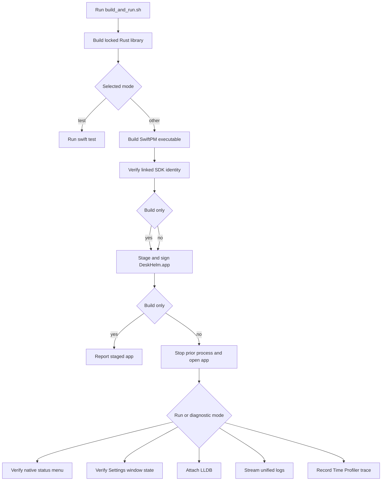
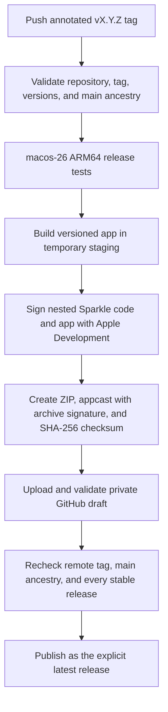

# Operations And Validation

## Preconditions

Repository-native tasks are declared in `Makefile.toml` and invoked with `cargo make <task>`. Install only what the selected task needs:

| Tool | Needed by |
| --- | --- |
| Project Rust toolchain from `rust-toolchain.toml` | Rust check, lint, test, and build tasks |
| Nightly toolchain with rustfmt | `fmt-rust`, `fmt-rust-check` |
| Node.js/npm from `.node-version` | TypeScript check, format, lint, test, and template-marker tasks |
| Xcode/Swift 6.2 on macOS | SwiftPM app build and Swift tests; the app supports macOS 14 or later |
| `cargo-make` | Every `cargo make` entrypoint |
| `taplo` | TOML format tasks |
| `cargo-vstyle` | vstyle tasks and the composite lint/full gates |
| `cargo-nextest` | test tasks |

`rust-toolchain.toml` is the sole selector for ordinary Rust commands. It selects stable with the minimal profile and adds Clippy; Cargo and rustc come from that profile. Rust formatting is the only explicit toolchain exception: `fmt-rust` and `fmt-rust-check` run nightly rustfmt because `.rustfmt.toml` uses nightly features. Third-party Cargo tools remain separate prerequisites. `.node-version`, `package.json`, and `package-lock.json` pin Node.js, npm, and the TypeScript development graph. Run `npm ci --ignore-scripts` before a TypeScript task or the full aggregate; repository tasks validate but do not install dependencies. The release source, build, and publisher jobs each select that exact Node version before any TypeScript release program runs. On macOS, `script/build_and_run.sh` prefers `/Applications/Xcode-beta.app` when `DEVELOPER_DIR` is unset, then falls back to the active developer directory from `xcode-select`. SwiftPM declares tools version 6.2 and a macOS 14 deployment minimum. CI reads the ordinary Rust toolchain and components from `rust-toolchain.toml`, installs nightly rustfmt separately, installs Taplo for the TOML job, and performs the locked npm install for the TypeScript job.

Sources: `rust-toolchain.toml`, `Makefile.toml`, `.node-version`, `package.json`, `package-lock.json`, `.github/workflows/language.yml`, `.github/workflows/release.yml`.

## Public Check Aggregate

```sh
cargo make check
```

`check` is a cargo-make composite whose dependencies are `check-rust`, macOS-only `check-swift`, `check-typescript`, `fmt-check`, `lint`, and `test`. `check-swift` runs the native build script with `--build-only`; `test` includes credential-free `test-release` plus Rust, macOS-only Swift, and TypeScript tests. On non-macOS hosts cargo-make skips the conditioned Swift task, but the release self-check still runs. `Makefile.toml` establishes the dependency set but does not state a runtime ordering contract. When deterministic, fail-fast diagnosis matters, invoke the targeted commands explicitly in this recommended sequence:

```sh
cargo make fmt-check
cargo make check-rust
cargo make check-typescript
cargo make lint
cargo make test
```

This diagnostic order catches mechanical formatting drift before compilation/lint/test analysis; it does not change the task definitions. `check` is the public aggregate for source validation, but it no longer includes the deleted Decodex `check-docs` task. Review OpenWiki separately with the focused checks in [Knowledge Maintenance](knowledge-maintenance.md#openwiki-drift-check).

## Complete Task Matrix

| Task | Exact behavior | Mutates files? |
| --- | --- | --- |
| `check` | Composite: `check-rust`, macOS-only `check-swift`, `check-typescript`, `fmt-check`, `lint`, `test` | Build/tool caches |
| `check-rust` | `cargo check --all-features --all-targets --workspace` | Build cache only |
| `check-swift` | On macOS, run `./script/build_and_run.sh --build-only` | Rebuilds caches and stages/signs the app without launching |
| `check-typescript` | Run the installed TypeScript compiler with `--noEmit --project tsconfig.json` | Tool cache only |
| `fmt` | Composite: `fmt-rust`, `fmt-toml`, `fmt-typescript` | Yes |
| `fmt-check` | Composite: `fmt-rust-check`, `fmt-toml-check`, `fmt-typescript-check` | No |
| `fmt-rust` | `rustup run nightly cargo fmt --all` | Yes |
| `fmt-rust-check` | Same with `-- --check` | No |
| `fmt-toml` | `taplo fmt` | Yes |
| `fmt-toml-check` | `taplo fmt --check` | No |
| `fmt-typescript` | Oxfmt over `scripts/` and the owned TypeScript JSON configuration files | Yes |
| `fmt-typescript-check` | Same Oxfmt scope with `--check` | No |
| `lint` | Composite: `lint-rust`, `lint-typescript`, `lint-vstyle` | No |
| `lint-fix` | Composite: `lint-fix-rust`, `lint-fix-typescript`, `lint-fix-vstyle` | Yes |
| `lint-rust` | Workspace/all-target/all-feature Clippy with repository deny policy | Build cache only |
| `lint-fix-rust` | Same Clippy policy with `--fix --allow-dirty` | Yes |
| `lint-typescript` | Oxlint over `scripts/` with the checked-in type-aware deny policy | No |
| `lint-fix-typescript` | Same Oxlint policy with safe `--fix`; suggestions and dangerous fixes remain disabled | Yes |
| `lint-vstyle` | Composite: `lint-vstyle-rust` | No |
| `lint-vstyle-rust` | `cargo vstyle curate --language rust --workspace --all-features --strict` | No |
| `lint-fix-vstyle` | Composite: `lint-fix-vstyle-rust` | Yes |
| `lint-fix-vstyle-rust` | `cargo vstyle tune --language rust --workspace --all-features --strict` | Yes |
| `list-template-markers` | Run the tracked-file marker inventory through Node.js | No |
| `test` | Composite: `test-release`, `test-rust`, macOS-only `test-swift`, `test-typescript` | Build/tool caches only |
| `test-release` | Run `script/release/self-check.py`, including the Node-native TypeScript publisher contract tests, without release credentials | Temporary self-check fixtures only |
| `test-macos-release` | On macOS, run `test-release`, then Swift tests and app staging with `DESKHELM_CONFIGURATION=release` | Cargo/Swift build caches and staged app |
| `test-rust` | `cargo nextest run --workspace --all-targets --all-features` | Build cache only |
| `test-swift` | On macOS, build the Rust library and run `swift test` through `./script/build_and_run.sh --test` | Cargo/Swift build caches only |
| `test-typescript` | `node --test` over the discovered `*.test.ts` files | Tool cache only |

The Clippy tasks deny `clippy::all`, `clippy::too_many_lines`, `clippy::unwrap_used`, `clippy::use_self`, `clippy::wildcard_imports`, `missing-docs`, `unused-crate-dependencies`, and all warnings. `clippy.toml` allows unwrap only in tests, sets a 120-line threshold, and warns on wildcard imports. Rust formatting intentionally uses nightly features from `.rustfmt.toml`; Taplo excludes `Makefile.toml` and generated/local trees.

The TypeScript compiler enables strict checking, indexed-access uncertainty, exact optional-property semantics, control-flow checks, and Node-erasable syntax. Oxlint denies correctness, suspicious, and performance diagnostics plus explicit `any`, unsafe type operations, non-null assertions, unhandled or misused promises, non-`Error` throws, and non-exhaustive switches. Warnings and unused suppression directives fail the task. Oxfmt is the sole TypeScript formatter; the prior root Prettier files were unused and are removed. The npm lock contains platform-specific optional binary packages for TypeScript and Oxc; `.npmrc` disables lifecycle scripts and requires exact saved versions.

History: commit `452039e` separated `cargo check` from Clippy and made task contracts explicit; `b250fc0` split vstyle wrappers by language for monorepo extension.

Sources: `Makefile.toml`, `clippy.toml`, `.rustfmt.toml`, `.taplo.toml`, `tsconfig.json`, `.oxfmtrc.json`, `.oxlintrc.json`, `.npmrc`; history: commits `452039e`, `b250fc0`.

## TypeScript Template Maintenance

Install the exact development graph and list every tracked template marker:

```sh
npm ci --ignore-scripts
cargo make list-template-markers
```

The marker script forwards `git grep` output as `path:line:text` records. A marker record means the repository still contains template identity. No marker records means no configured marker was found; cargo-make can still print its own task status. Both inventory results are successful; inability to execute Git or another Git failure fails the task. The helper scans all tracked files, so it does not read untracked or ignored secret-bearing files.

Before Node/npm is installed, use a narrowly scoped `rg` fallback over repository source as described in [Template Adoption](template-adoption.md#residual-identity-checks). Keep that fallback for bootstrap only; `list-template-markers` owns the installed repository command.

Sources: `scripts/list-template-markers.ts`, `scripts/list-template-markers.test.ts`, `Makefile.toml`, `openwiki/template-adoption.md`.

## Native App Build And Run

The repository-owned SwiftPM entrypoint builds the Rust static library, links the Swift package, verifies the executable's linked SDK identity, creates a local app bundle, and opens it:

```sh
./script/build_and_run.sh
```

The script uses `DESKHELM_CONFIGURATION=debug` by default; set it to `release` for Cargo and Swift release builds. It exports `DESKHELM_RUST_LIB_DIR` as `target/<configuration>` so `apps/deskhelm/macos/Package.swift` can link `libdeskhelm`. The staged short version defaults to the workspace package version; `DESKHELM_APP_VERSION` and `DESKHELM_BUILD_VERSION` can supply validated release metadata. `DESKHELM_APP_STAGE_DIR` can redirect staging only to a child of an existing `RUNNER_TEMP`, keeping release work in ephemeral storage. Swift build, test, and binary-path queries receive explicit `-platform_version macos` linker arguments with deployment minimum 14.0 and the SDK version selected by `xcrun`; after an app build, `vtool` must report that same linked SDK or the script fails. This avoids SwiftPM's swiftbuild backend recording the deployment target as both build-version values, which would lose current linked-on UI behavior.

Every non-test mode stages `DeskHelm.app` under `apps/deskhelm/macos/dist/` by default, including `--build-only`. The staged bundle contains executable `DeskHelmMac`, bundle ID `com.acgbox.deskhelm`, macOS 14 minimum, `LSUIElement=true`, and the exact SwiftPM Sparkle 2.9.4 framework from the selected binary directory under `Contents/Frameworks`; the script rejects a framework version that differs from `Package.resolved`. Staging removes development-only rpaths, adds `@executable_path/../Frameworks` when missing, and delegates inside-out signing of known Sparkle nested code to `script/release/sign-macos-app.sh`. Development signing is ad hoc by default; `DESKHELM_CODE_SIGN_IDENTITY` selects an authorized Apple Development identity when Accessibility authorization must persist across rebuilds. The release path invokes the same signer in Hardened Runtime Apple Development mode with `--timestamp=none`.

`DESKHELM_SPARKLE_APPCAST_URL` and `DESKHELM_SPARKLE_PUBLIC_ED_KEY` are optional staging inputs and must be supplied together. When present, the script adds the HTTPS feed, Ed25519 public key, daily checks, and automatic-update capability to `Info.plist`; `SoftwareUpdater` still validates the feed URL and requires a base64-decoded 32-byte public key before enabling Sparkle. When absent, the app labels the action **View Releases…** and opens GitHub Releases. These values are release configuration, not source defaults. The release packager reads the public key from `script/release/sparkle-public-ed-key.txt` and supplies it to staging. This local development bundle remains separate from the signed app archive produced by the release workflow.



The script owns the native build, staging, launch, and diagnostic branches.

### Script Modes And Diagnostics

| Mode | Behavior |
| --- | --- |
| no argument or `--run` | Build Rust and Swift, stage the app, replace a running `DeskHelmMac`, and launch |
| `--build-only` | Build Rust and Swift, verify the linked SDK, stage and sign the app with Sparkle, and stop without launching; used by `check-swift` |
| `--test` | Build the Rust library and run Swift tests with the explicit platform-version linker arguments, without staging or launching |
| `--verify` | Launch, then confirm the process stays alive and publishes accessory startup state plus the expected native `NSStatusItem` menu readiness state |
| `--verify-settings` | Launch with Settings requested, then confirm accessory policy plus visible, key, main, on-screen Settings state, toolbar/pane metadata, and positive dimensions |
| `--debug` | Launch and attach LLDB to the process |
| `--logs` | Launch and stream unified logs for `DeskHelmMac` |
| `--telemetry` | Launch and record a Time Profiler trace under `apps/deskhelm/macos/dist/` |

`--verify` checks through app-published `UserDefaults` that DeskHelm starts with accessory activation policy, creates its square, image-only status item, and attaches a native menu. It cannot prove that macOS visually presents the item when menu-bar space, a notch, or a third-party menu manager intervenes. `--verify-settings` additionally checks that the accessory policy remains active and checks the published Settings phase, visibility, key/main state, screen intersection, icon-toolbar pane metadata, window number, and dimensions. Both normal and Settings-verification launches start the always-on volume-key controller; missing Accessibility trust remains silent and opens no permission UI. Neither mode tests menu and toolbar interaction, Accessibility trust changes, permission-guide interaction or drag-and-drop, login registration, Sparkle UI, successful media-key interception, the transient HUD, or physical DDC/CI behavior. The app lifecycle behind these checks is documented in [Architecture and Runtime](architecture-and-runtime.md#native-appkit-shell-and-settings), and the event path is documented in [Architecture and Runtime](architecture-and-runtime.md#keyboard-volume-control).

SwiftPM declares two test targets. `DeskHelmAppCoreTests` depends directly on both `CDeskHelm` and `DeskHelmAppCore`. Its hardware-free ABI tests verify the imported status constants and `DeskHelmVolumeResult` memory layout, link every exported C symbol, exercise null/invalid calls, and confirm Rust-owned error cleanup. Its application tests exercise always-on launch actions in normal and Settings-verification modes, initial-loading visibility, refresh-state separation, one requested refresh waiting for an active preview, a direct caller joining that request, explicit skipped-refresh reporting while busy, continuous draft clamping, volume-state validation, refresh behavior, latest-target preview coalescing, preview-acceptance joining and cancellation, automatic and release-time confirmation, refresh and stale-result races, failure recovery, cadence-derived animation planning, shared visual-presentation clamping, per-place digit-transition mapping, decoder allowlisting, system-repeat acceptance, one-point media-key adjustment, active-interception state, and generation-token cancellation or replacement of in-flight enable requests. `DeskHelmMacTests` links the executable target and Sparkle. Its controller tests cover full event forwarding, off-route cancellation, silent startup without Accessibility, grant/revoke/regrant, idempotent start, transient display-failure recovery, queued-write cancellation, in-flight-write/reset ordering, stale pre-reconfiguration read rejection, pre-settlement gating, and invalidation during a blocked read or scheduled recovery. Display-reconfiguration monitor tests cover callback-burst coalescing, waiting for a post-change callback, ordered callback delivery, and dropping queued delivery after deactivation. Feedback tests cover system preference and standalone-Shift inversion, resource fallback order, final accepted-write release playback, held-key coalescing, stale sequence replacement, failure silence, maximum-volume cadence, route loss, and cancellation.

The suites do not separately cover a refresh requested during confirmation or duplicate button requests. They also do not exercise the custom control's pointer, keyboard, or VoiceOver interaction, rolling-number rendering, native menu commands, Settings toolbar/window focus, a live Accessibility trust change or permission-guide drag, login-item registration, Sparkle UI, Settings/HUD coordination, the live event tap, live Core Graphics callbacks on physical hot-plug hardware, rendered interpolation, actual `NSSound` output routing, audible cadence, recovery wall-clock timing, or opaque-session timing on physical hardware. The tested contracts support the [SwiftUI Display and keyboard HUD runtime](architecture-and-runtime.md#swiftui-display-settings).

Sources: `script/build_and_run.sh`, `apps/deskhelm/macos/Package.swift`, `apps/deskhelm/macos/Sources/`, `apps/deskhelm/macos/Tests/`, `Makefile.toml`.

## CLI Build And Run

Common CLI commands are direct Cargo commands rather than cargo-make tasks:

```sh
cargo build --locked -p deskhelm
cargo run --locked -p deskhelm -- volume
cargo run --locked -p deskhelm -- volume 25
cargo build --locked -p deskhelm --profile final-release
```

- The `volume` subcommand reads when `LEVEL` is omitted. It sets an integer from 0 through 100 only after the display reports a 0–100 volume range.
- Default debug output is `target/debug/deskhelm`; `final-release` output is `target/final-release/deskhelm` unless `--target` adds a target-triple directory.
- Hardware operations are implemented only for Apple Silicon macOS and compatible DDC/CI paths. Other compiled targets return an explicit unsupported-platform error.
- Release reproducibility relies on `--locked`; an out-of-date lockfile is a release blocker rather than permission to omit the flag.

The CLI reaches the conservative display-selection and DDC/CI pipeline described in [Architecture and Runtime](architecture-and-runtime.md#display-selection-and-safety).

Sources: `README.md`, `Cargo.toml`, `apps/deskhelm/Cargo.toml`, `apps/deskhelm/src/cli.rs`, `apps/deskhelm/src/display.rs`.

## CI Checks

Current `.github/workflows/language.yml` runs on pushes and pull requests targeting `main`, plus merge queues. It has no path filters, so documentation-only changes trigger the language checks too.

Three Linux jobs run independently:

- **Rust check:** rustfmt check → Cargo check → vstyle action → Clippy → nextest. The setup action reads the ordinary toolchain and Clippy component from `rust-toolchain.toml`; the job installs nightly rustfmt with the minimal profile, installs cargo-make and nextest separately, and gets vstyle from `acg-box/vibe-style`.
- **TOML check:** installs cargo-make and Taplo, then runs `fmt-toml-check`.
- **TypeScript and release check:** reads the exact Node.js version from `.node-version`. From `$RUNNER_TEMP`, before npm can inspect the repository `devEngines`, it installs npm 11.16.0 globally without lifecycle scripts. It clears the shell command cache, reads back the exact Node.js and npm versions, returns to the workspace, and installs the locked npm graph without lifecycle scripts. It then runs TypeScript format, compiler, type-aware lint, TypeScript tests, and the credential-free release self-check through cargo-make.

The language workflow does **not** invoke `cargo make check` as one command, build the Swift app, or validate OpenWiki. Running on a documentation-only diff proves only its listed Rust, release-contract, TOML, and TypeScript checks. Swift build and test coverage runs in the tag-triggered macOS release job and in local macOS validation. The former CodeQL workflow has been removed, so no tracked workflow currently provides that security-analysis coverage. Actions in the language and release workflows are SHA-pinned. Dependabot covers Cargo, root npm, and GitHub Actions.

Source: `.github/workflows/language.yml`.

## Release Pipeline

A push of an annotated stable tag matching `v<major>.<minor>.<patch>` starts `.github/workflows/release.yml`. There is no manual preparation or dry-run trigger. The first Linux job runs `scripts/release/validate-release-source.ts` under the exact Node.js version in `.node-version`. The validator checks that the run belongs to `acg-box/deskhelm`, the tag points directly to a commit, its version matches the workspace package and lockfile, the exact official Sparkle declaration matches the resolved version and revision in `Package.resolved`, and the commit is reachable from canonical `origin/main`. Its version, Sparkle version and revision, and tag-commit outputs bind later jobs to the validated source. The shared `scripts/release/release-contract.ts` parser rejects leading zeroes and bounds each stable-version component before converting it to `bigint`. The tag must be annotated, but the tooling does not verify a cryptographic tag signature; tag-push controls and approval of the protected `release` environment remain part of the trust boundary.



The release moves from immutable source validation through Apple Development signing checks to draft-first publication; any failure before the final publish operation leaves no new public release.

The macOS job runs `cargo make test-macos-release`, then `script/release/package-macos.sh` on an ARM64 `macos-26` runner. It builds before writing credentials to disk, stages only inside `RUNNER_TEMP`, verifies the app's version, checked-in update key, canonical feed, and embedded Sparkle 2.9.4 layout, then imports the Apple Development certificate into a temporary keychain. That keychain must expose exactly one valid codesigning identity, and it must be the requested identity. The release path pins Personal Team `RD3D4LH465`. `sign-macos-app.sh` signs the known Sparkle code graph inside-out with Hardened Runtime and `--timestamp=none`, rejecting ad hoc signatures, any other Apple team, timestamps, and unsafe outer entitlements.

Packaging validates the complete signature graph with `codesign` before creating the public ZIP. Sparkle `Versions/Current` can select a safe direct child such as `A` or `B`; signing and artifact validation resolve that child dynamically and require `Versions` to contain exactly that real directory and the `Current` link. They reject any other version, alias, nested app, or XPC payload. Archive validation also bounds central-directory entry count, declared uncompressed bytes, member paths, metadata, plist and appcast sizes, and the `Current` target. It rejects duplicate member names and XML `DOCTYPE` or `ENTITY` declarations before metadata parsing. Packaging does not submit to Apple notarization, staple a ticket, or use Gatekeeper acceptance as a success condition. `sparkle-appcast.sh` signs that exact ZIP with DeskHelm's private Ed25519 key and emits an ARM64, macOS 14 appcast entry. The final artifact set is exactly:

- `deskhelm-aarch64-apple-darwin.zip` containing `DeskHelm.app`
- `appcast.xml` for the in-app Sparkle feed
- `deskhelm-aarch64-apple-darwin.zip.sha256`

The Linux publisher has the workflow's only `contents: write` permission. Every tag release shares the global `release` concurrency group and a run is never canceled in progress. The Node 24 TypeScript publisher validates the local artifact triplet before its first GitHub mutation. It checks the remote annotated direct tag and canonical `main` ancestry, scans a bounded complete pagination of all published stable SemVer releases, and requires the candidate to advance the greatest version. It creates or reuses only a same-tag private draft, deletes every old draft asset by asset ID, and streams the exact triplet to GitHub with the Node network transport; it has no GitHub CLI dependency. It then reads, downloads, hashes, and validates the complete remote set. Asset state, safe integer size, canonical URL, and GitHub SHA-256 digest are mandatory.

Immediately before publication, the publisher repeats the remote tag, direct-commit, `main` ancestry, and complete stable-version checks. It then re-reads, downloads, hashes, and validates the exact draft bytes as the last operation before the `PATCH`. The single final mutation sets `draft=false` and `make_latest=true`. After a successful or uncertain `PATCH`, the publisher fetches the public release and validates its public downloaded bytes. Safe reads have bounded body, pagination, timeout, and retry limits; they honor `Retry-After` for HTTP 429 and retry transient network and 5xx failures. Mutations are not blindly retried. An uncertain create, delete, upload, or publish result converges through bounded reads. A retry against an existing public same-tag release is read-only and validates its immutable downloaded bytes instead of comparing them with a rebuilt archive whose ZIP metadata can differ. The credential-free `--dry-run` performs local artifact validation only and makes no GitHub request.

The checked-in `script/release/sparkle-public-ed-key.txt` contains DeskHelm's public Sparkle key. Configure the matching private key as the DeskHelm repository secret `DESKHELM_SPARKLE_PRIVATE_ED_KEY`. The verifier accepts the Sparkle 2.9.4 32-byte seed and legacy 96-byte secret formats; for either format, it rejects a public-key mismatch. Make organization secrets `APPLE_CERTIFICATE_P12_BASE64`, `APPLE_CERTIFICATE_PASSWORD`, and `APPLE_SIGNING_IDENTITY` available to this repository. The Apple identity must start with `Apple Development:` and belong to Personal Team `RD3D4LH465`. DeskHelm forbids the generic `SPARKLE_PRIVATE_ED_KEY` name to reduce accidental key reuse. Only the final Linux publisher uses the protected `release` environment. Do not put private credential values in source or documentation.

This pipeline publishes only the Apple Development-signed Apple Silicon app. The app is not notarized. On first launch, macOS can block it; the user must open **System Settings > Privacy & Security**, select **Open Anyway** for DeskHelm, then confirm **Open**. It no longer emits Windows/Linux CLI archives and does not publish the Rust crate. Hardware operation still depends on the compatible display path in [Architecture and Runtime](architecture-and-runtime.md#lg-39gx950b-usb-c-boundary).

Run the credential-free contract suite before changing the workflow or release scripts:

```sh
cargo make test-release
```

It exercises source/version rejection, bounded large-component stable SemVer comparison, bounded pagination and retries, signing order and dynamic Sparkle layout, appcast and artifact validation, exact draft repair, public read-only retry, late source/version races, response limits, and shell/Python/TypeScript static checks with fixtures and injected transports. It does not perform real Apple Development signing or live GitHub publication.

Sources: `.github/workflows/release.yml`, `Makefile.toml`, `script/build_and_run.sh`, `script/release/`, `scripts/release/`, `.node-version`, `Cargo.toml`, `Cargo.lock`, `apps/deskhelm/macos/Package.swift`, `apps/deskhelm/macos/Package.resolved`.

## Failure Interpretation

- Missing command/tool: satisfy the prerequisite; do not rewrite the task to bypass the expected tool without a deliberate contract change.
- Format failure: run `cargo make fmt`, inspect changes, then rerun `fmt-check`.
- Cargo check failure: resolve compilation/features/targets before interpreting downstream lint/test noise.
- TypeScript check failure: resolve compiler diagnostics under the pinned Node/TypeScript versions before interpreting type-aware lint noise.
- Clippy/vstyle failure: fix directly or use the matching `lint-fix*` task, then review all mutations before rerunning read-only gates.
- Oxlint failure: fix the diagnostic directly or use `lint-fix-typescript` for safe fixes only; review every mutation before rerunning compiler, lint, and tests.
- Test failure: treat as a regression or broken assumption in the current diff until evidence shows an environment/tool issue.
- Release failure: distinguish source validation, release-mode tests/build, signing, appcast/artifact validation, draft upload, and final publication. Before the final API operation, retries may reuse and repair a private draft; a public release retry validates the existing remote bytes.

Before merge, prefer `cargo make check` plus the focused OpenWiki drift checks and any release-specific contract checks justified by the changed surface. Record unavailable tools and unrun checks explicitly rather than claiming readiness.
